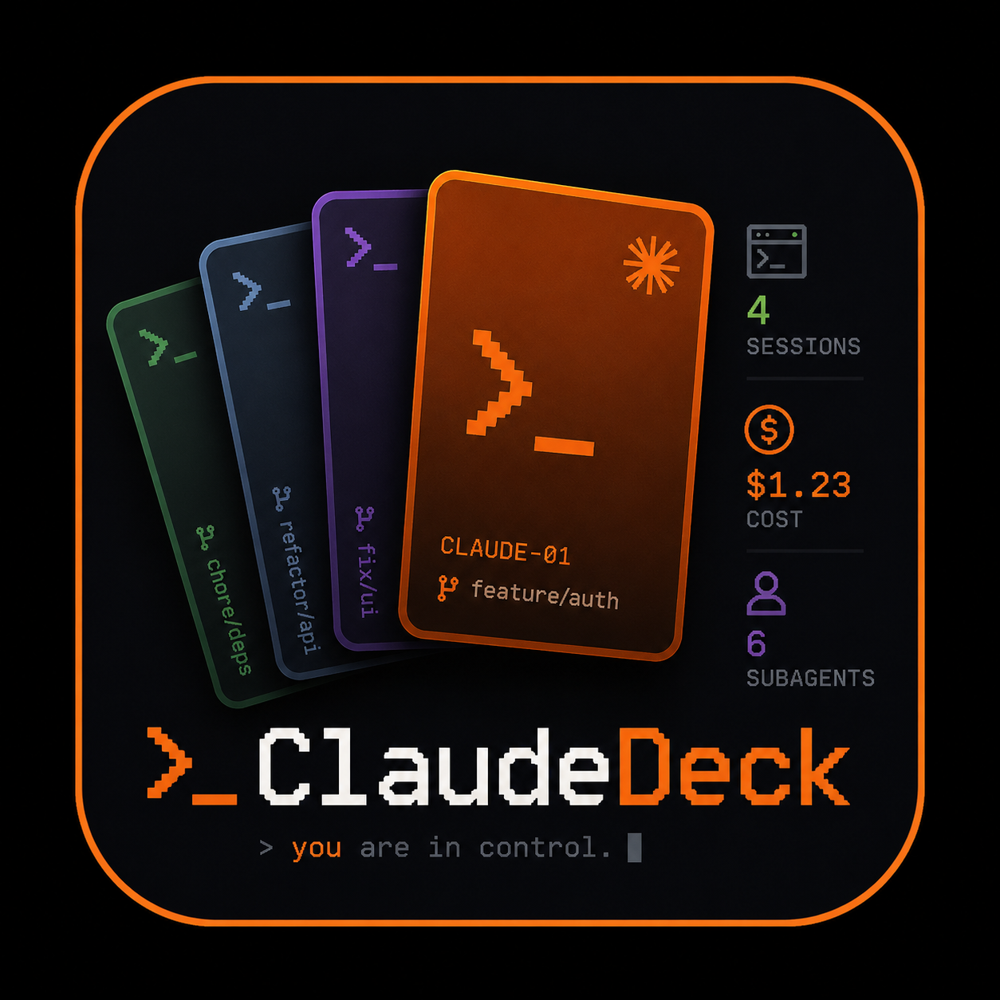
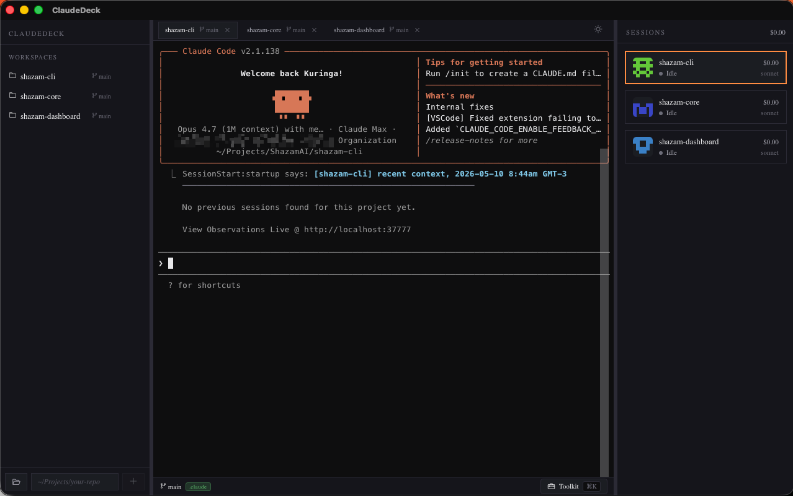
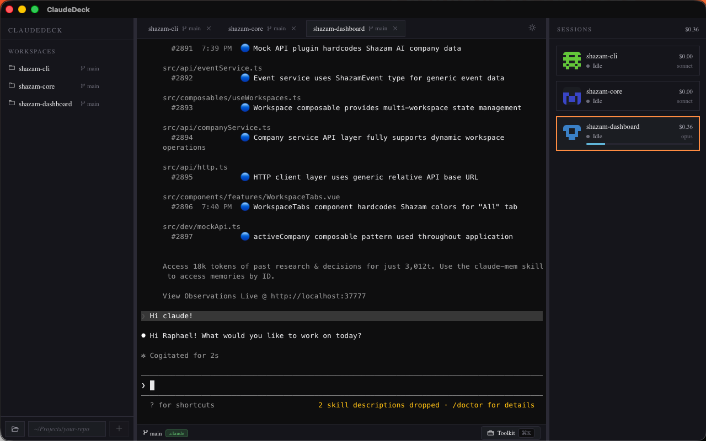
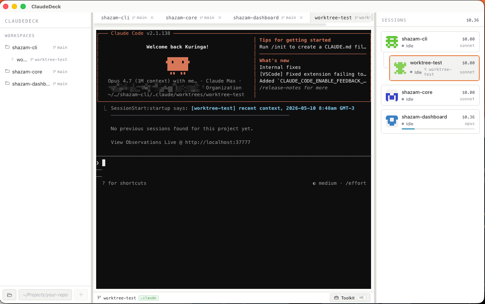
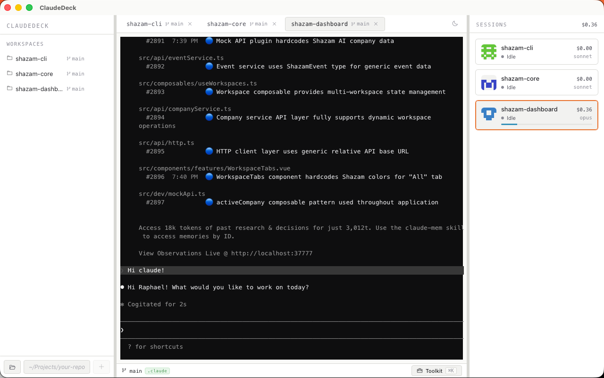

<div align="center">
  

  # ClaudeDeck

  **A native desktop cockpit for orchestrating multiple [Claude Code](https://claude.com/claude-code) sessions in parallel** — with git worktree isolation, real-time status, cost tracking, and project-aware agent dispatch.

  > Run 4–6 Claudes side by side. Each in its own worktree. Each tracked in real time. Each connected to your team's `.claude/` agent pipeline.

  <sub>Cross-platform (macOS · Windows · Linux). Built with Tauri 2 + Svelte 5 + Rust. MIT.</sub>
</div>

---

## Origin

ClaudeDeck is **inspired by and based on the ideas in [intuitive-compute/DraftFrame](https://github.com/intuitive-compute/DraftFrame)** — an open-source macOS-only Claude Code worktree manager built in Swift / AppKit / SwiftTerm.

DraftFrame nailed the core insight: that Claude Code is best used in **parallel sessions over isolated git worktrees**, with status and cost surfaced from Claude's own files (`~/.claude/sessions/<pid>.json`, `~/.claude/projects/<cwd>/*.jsonl`).

ClaudeDeck takes those mechanics and rebuilds them on a cross-platform stack (Tauri + Svelte + Rust + xterm.js + portable-pty), then adds a deeper integration with the `.claude/` pipeline pattern: auto-discovery of `.claude/agents/`, state-aware pipeline actions, one-click agent dispatch, and stacked-PR-friendly worktree nesting.

If you're on macOS only and want a pure-Swift implementation, **DraftFrame remains an excellent option**. ClaudeDeck exists to make the same workflow available on Windows and Linux, with extra hooks into the team-defined `.claude/` agent ecosystem.

---

## Screenshots

<div align="center">
  
  
  
  
</div>

---

## Highlights

- **Multi-session terminals** — every tab is an independent `claude` process running in its own pseudo-terminal. Nothing shared, nothing colliding.
- **Worktree isolation** — sessions run in `git worktree`-managed branches under `<repo>/.claude/worktrees/`, so parallel work never steps on itself. Stacked worktrees (worktree-of-a-worktree) are first-class for stacked-PR workflows.
- **Status awareness** — reads Claude Code's per-pid status file at `~/.claude/sessions/<pid>.json` for authoritative `Idle / Generating / Thinking` state instead of fragile TUI parsing.
- **Cost & token tracking** — tails `~/.claude/projects/<cwd>/*.jsonl` and applies local pricing for Opus / Sonnet / Haiku, including cache creation and read tiers.
- **Subagent counter** — `↳ 2/5` chip on the session card shows live `Task`/`Agent` tool dispatches in flight vs. completed.
- **Context window gauge** — per-session bar tints from cyan → yellow → red as you fill the model's context.
- **Resume previous sessions** — detects the latest JSONL per workspace and offers `↻ Resume` to continue exactly where you left off. Optional auto-resume on launch (cap of 3 most recent within 6h).
- **Auto-discovery of `.claude/`** — when you add a workspace that has `.claude/agents/*.md`, ClaudeDeck parses each agent's frontmatter and wires up a one-click dispatch button. Pipeline state (unpushed commits, `seeds-pending.md` size) becomes clickable CTAs in the status bar.
- **Toolkit panel (⌘K)** — three-section drawer: Pipeline (state-aware actions), Your Agents (auto-discovered), Custom Commands (your shortcuts: shell / prompt / url / agent).
- **Native drag-drop of files** — drop an image into the window and it lands as a bracketed paste in the active session, exactly like Claude Code's native terminal behavior.
- **Notifications** — desktop alert when a non-active session settles back to Idle. Multitask without watching every tab.
- **Drag-to-reorder tabs**, light/dark theme, workspace search, procedural pixel-art avatars per workspace.

---

## Stack

- **Backend** · Rust + Tauri 2 — `portable-pty` for cross-platform PTY (openpty on Unix, ConPTY on Windows), `notify` for filesystem watchers, native shell-out to `git` for worktree operations.
- **Frontend** · SvelteKit + Svelte 5 (runes) + xterm.js + Phosphor Icons. SPA mode via `adapter-static`.
- **Bundle** · ~10 MB on macOS, ~12 MB on Windows, ~15 MB on Linux.

---

## Install

### From source

```bash
git clone https://github.com/raphaelbarbosaqwerty/ClaudeDeck.git
cd ClaudeDeck
pnpm install
pnpm tauri dev          # development
pnpm tauri build        # production .app / .dmg / .exe / .deb / .AppImage
```

Pre-built artifacts land in `src-tauri/target/release/bundle/`.

### Prerequisites

- macOS 10.15+ / Windows 10+ / Linux with WebKit 2 GTK
- Rust stable (1.78+)
- Node.js 20+ and pnpm
- The [`claude` CLI](https://claude.com/claude-code) on `PATH` (or installed in a known location like `/opt/homebrew/bin/claude`, `~/.claude/local/claude`, `%APPDATA%\npm\claude.cmd`)

---

## Troubleshooting

### macOS: "ClaudeDeck is damaged and can't be opened" / "cannot be opened because Apple cannot check it for malicious software"

This happens because the published `.dmg` releases are not yet code-signed
or notarized with an Apple Developer ID. macOS sets a **quarantine
extended attribute** on every downloaded file, which Gatekeeper then
refuses to launch.

**Fix in one line:** clear the quarantine attribute after moving the app to
`/Applications/`.

```bash
xattr -cr /Applications/ClaudeDeck.app
```

What this does:

- `xattr` is the macOS tool for managing **extended attributes** on files.
- `-c` means **clear all** extended attributes.
- `-r` means **recursive** — required because `.app` is actually a folder
  full of files, each with its own quarantine flag.

After running it, double-click the app — it opens normally and the warning
is gone for good. You only need to do this once per install.

If you'd rather use the GUI: open **System Settings → Privacy &
Security**, scroll down, and click **"Open Anyway"** next to the
ClaudeDeck warning. Then confirm in the popup. Same effect.

> ⚠ Only run `xattr -cr` on apps you trust. The quarantine flag exists for
> a reason — it's macOS's way of asking "did you really mean to run this?"
> Stripping it bypasses that check, so make sure your `.dmg` came from
> [the official releases page](https://github.com/raphaelbarbosaqwerty/ClaudeDeck/releases).

### macOS: app launches but `claude` not found

ClaudeDeck searches `PATH`, then well-known install locations
(`/opt/homebrew/bin/claude`, `/usr/local/bin/claude`,
`~/.claude/local/claude`, `~/.local/bin/claude`), then asks a login zsh
to resolve it. If all that fails:

```bash
which claude            # confirm it's on your PATH
ls -l $(which claude)   # confirm it's executable
```

If `which claude` finds it but the app doesn't, your PATH is set in
`.zshrc` (interactive only). Move that line to `.zprofile` (login shells)
so GUI applications inherit it.

### Linux: missing `libwebkit2gtk` / app won't launch

Tauri uses WebKit GTK as its webview. Install the runtime:

```bash
sudo apt install libwebkit2gtk-4.1-0 libgtk-3-0
```

(Adjust for your distro — `dnf install webkit2gtk4.1` on Fedora,
`pacman -S webkit2gtk-4.1` on Arch.)

### Windows: SmartScreen warning on first run

Same root cause as macOS Gatekeeper — the binary isn't yet signed with an
Authenticode certificate. Click **More info → Run anyway**. After the
first launch, SmartScreen stops complaining for that exact binary on
that machine.

---

## How it works

```
┌─────────────────────────────────────────────────────────────────────┐
│  ClaudeDeck UI · Svelte 5 + xterm.js                                 │
└─────────────────────────────────────────────────────────────────────┘
                                  │
            Tauri IPC · invoke / emit("session:state:<id>", …)
                                  │
┌─────────────────────────────────────────────────────────────────────┐
│  Rust backend                                                        │
│                                                                      │
│  PtyManager   ───── spawn `claude` ──── per-session reader thread    │
│       │                                                              │
│       ↓        session_id                                            │
│  StatusWatcher  ←─── ~/.claude/sessions/<pid>.json   (poll 1.5s)     │
│  JsonlWatcher   ←─── ~/.claude/projects/<cwd>/*.jsonl (poll 1.5s)    │
│  Discovery      ←─── <workspace>/.claude/agents/*.md                 │
│  WorktreeMgr    ────► git worktree add / remove / list                │
└─────────────────────────────────────────────────────────────────────┘
```

Every session is a real `claude` process. ClaudeDeck never proxies the API or rewrites prompts — it stays out of the conversation entirely. Status, cost, and subagent count come from Claude Code's own files, so anything you can do in `claude` you can do here.

---

## Pipeline awareness

If your repo has the standard `.claude/` pipeline layout:

```
.claude/
├── agents/
│   ├── senior-dev.md
│   ├── qa-tester.md
│   ├── pr-reviewer.md
│   └── learner-from-pr.md
├── skills/<project>/
│   ├── SKILL.md
│   ├── rules/*.md
│   └── seeds-pending.md
└── WORKFLOW.md
```

…ClaudeDeck reads it on workspace add and surfaces:

- A **quick-dispatch agent pill** for each agent in the bottom status bar.
- A **state-aware Pipeline section** in the toolkit:
  - "3 unpushed commits → @open-pr"
  - "5 entries in seeds-pending → @learner-from-pr"
- Description tooltips parsed from each agent's YAML frontmatter.

Click a pill → ClaudeDeck pastes `Use the @<agent> agent to: <your task>` into the active session. Claude's own subagent dispatcher takes over from there.

---

## Architecture

```
src/                              · SvelteKit frontend (SPA mode)
├── routes/+page.svelte           · 3-column shell
├── lib/
│   ├── components/               · Sidebar, Tabs, Terminal, Toolkit, …
│   ├── stores/                   · app + settings (Svelte 5 runes)
│   ├── api.ts                    · Tauri invoke wrappers
│   └── utils/                    · color hash, avatar SVG generator

src-tauri/                        · Rust backend
├── src/
│   ├── pty.rs                    · portable-pty manager + claude binary discovery
│   ├── status_watcher.rs         · ~/.claude/sessions/*.json poller
│   ├── jsonl_watcher.rs          · JSONL tail + token/cost accumulator
│   ├── discovery.rs              · .claude/agents parsing + pipeline detection
│   ├── git.rs                    · `git worktree` shell-out
│   ├── workspaces.rs             · persistence + Tauri commands
│   ├── sessions.rs               · session lifecycle orchestration
│   └── toolkit.rs                · commands + agent dispatch
└── Cargo.toml
```

---

## Development

```bash
pnpm check                                      # svelte-check + tsc
cargo check --manifest-path src-tauri/Cargo.toml
```

To regenerate icons after editing `icon-source.png`:

```bash
pnpm tauri icon icon-source.png
```

---

## Roadmap

- Command palette (⌘P) over workspaces / sessions / agents
- Multi-session dispatch (one prompt, N parallel sessions)
- GitHub PR integration (open PR list per workspace, click → dispatch `pr-reviewer`)
- Activity feed across all sessions
- Handoff bundle (zip a session + branch + seeds for a colleague)
- Canvas mode (sessions as draggable cards on a 2D plane)
- Auto-summary on idle (1-line synthesis of what was done in that turn)
- Worktree graph view (visual tree of branches/worktrees per project)

---

## License

MIT. See [LICENSE](LICENSE).

---

## Acknowledgments

- **[DraftFrame](https://github.com/intuitive-compute/DraftFrame)** by Intuitive Compute — the original macOS-only Swift implementation that inspired this project. ClaudeDeck takes the multi-session worktree idea, re-implements it cross-platform, and extends it with auto-discovery of team-defined `.claude/` agent pipelines.
- **[Claude Code](https://claude.com/claude-code)** by Anthropic — the CLI being orchestrated.
- **[SwiftTerm](https://github.com/migueldeicaza/SwiftTerm)** by Miguel de Icaza — the inspiration behind DraftFrame's terminal emulation; replaced here by xterm.js for cross-platform reach.
